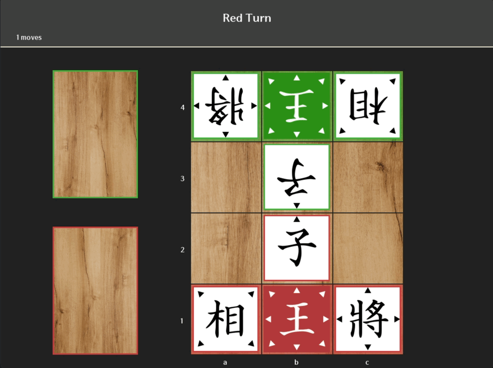
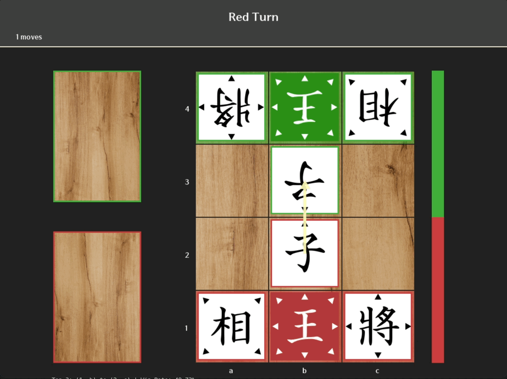
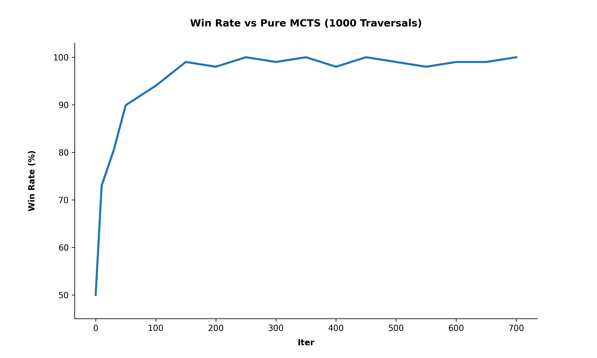

# twJanggi-AlphaZero  
Implementation of `십이장기(Twelve Janggi)` AI using the AlphaZero algorithm based on Self-Play

[십이장기](https://the-genius-show.fandom.com/wiki/Twelve_Janggi) is a 4\*3 mini-shogi variant derived from [Dobutsu Shogi](https://en.wikipedia.org/wiki/D%C5%8Dbutsu_sh%C5%8Dgi). This project provides an AlphaZero implementation for `십이장기`, including the training process, a pre-trained agent, and a playable GUI with analysis tools.

#### Battle Mode



#### Analyze Mode



### Evaluation
---
The model performance was evaluated by calculating the win rate against Pure MCTS with 1000 traversals.

**Iter 700 - (28k Self-Play)** was selected as the final master model.



### Getting Started
---
#### Installation

``` bash
git clone https://github.com/studixxne/twJanggi-Zero.git
cd twJanggi-Zero

pip install -r requirements.txt
```


#### Battle Mode
Play 1:1 against the trained AI model
``` bash
python play_human.py --first 1 --num_traversal 5000
```
- `first`: Set to `1` for human to play first, `0` for AI to play first
- `num_traversal`: Number of MCTS traversals per move


#### Analyze Mode  

Play analyze mode with AI move recommendation and game review features

``` bash
python analyze.py --num_traversal 1000 --num_deep_traversal 5000
```

- `num_traversal`: Default MCTS traversals for real-time analysis
- `num_deep_traversal`: Deeper MCTS traversals triggered when the `space` bar is pressed


#### Game Controls

| Key | Action | Mode |
| --- | ---    | --- |
| ESC | Reset the game to the initial state | Battle / Analyze |
| Left Arrow | Move back to the previous turn (Undo) | Analyze |
| Right Arrow | Move forward to the next recorded turn (Redo) | Analyze |
| Space Bar | Run Deep MCTS Search for better move recommendation | Analyze |


#### Arena

Benchmark performance by pitting two models against each other

``` bash
python arena.py --model1 --model2 --num_games --num_traversal
```

- `model1`: Path to the first model. Set to `none` to use Pure MCTS
- `model2`: Path to the second model. Set to `none` to use Pure MCTS
- `num_games`: Total number of games to play for evaluation
- `num_traversal`: MCTS traversals used during the arena match


#### Model Training

Train a new model by generating Self-Play data and optimizing the network. You can modify the architecture (e.g. `num_blocks`) or hyperparameters

``` bash
python train.py --iter --num_play --lr
```

- `iter`: Total number of training iterations
- `num_play`: Number of Self-Play games generated per iteration
- `lr`: Learning rate for the optimizer
- `others`: You can check additional hyperparameters and model configurations via the ArgumentParser help hint


### Reference
---
AlphaGo Zero: Mastering the game of Go without human knowledge  
AlphaZero: Mastering Chess and Shogi by Self-Play with a General Reinforcement Learning Algorithm  
John Levine - Monte Carlo Tree Search

### Attribution
---
Board Image - [Designed by Freepik](https://www.freepik.com)